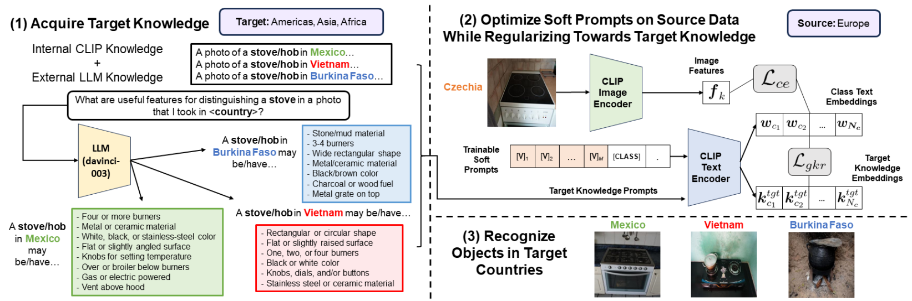

# Incorporating Geo-Diverse Knowledge into Prompting for Increased Geographical Robustness in Object Recognition  [CVPR 2024]

> [**Incorporating Geo-Diverse Knowledge into Prompting for Increased Geographical Robustness in Object Recognition**](https://arxiv.org/abs/2401.01482)<br>
> Kyle Buettner, Sina Malakouti, Xiang Lorraine Li, Adriana Kovashka

## Overview 



## Env setup

Follow the instructions in GeoKnowledgePrompting to create a conda environment/build relevant code. 

## Data processing

Please download the DollarStreet Kaggle dataset from [here](https://www.kaggle.com/datasets/mlcommons/the-dollar-street-dataset)

We filter the dataset to be only single object recognition. Follow notebooks/PreprocessDollarStreet.ipynb to generate a preprocessed version of the filtered dataset. 

Add a symbolic link in GeoKnowledgePrompting to location of the preprocessed dataset.
```
ln -s <PREPROC_IMAGES_PATH> dollarstreet_data
```
## Running code

Navigate to scripts for executable scripts to run training. For example:

```
bash all_train_vitb16_geoknowledgeprompting.sh tgt_llm_and_in_country_ensemble_dollarstreet 4.0
```

We provide example bash scripts for multiple experimental trials (EX: train_method_run_vit.sh). 

## Eval

TO COME SOON 

## Citation
If you use our work, please consider citing:
```bibtex
@inproceedings{geoknowledgeprompting,
  title={Incorporating Geo-Diverse Knowledge into Prompting for Increased Geographical Robustness in Object Recognition},
  author={Buettner, Kyle and Malakouti, Sina and Li, Xiang Lorraine and Kovashka, Adriana},
  booktitle={Proceedings of the IEEE/CVF Conference on Computer Vision and Pattern Recognition},
  pages={13515--13524},
  year={2024}
}
```

## Acknowledgements
Code is built from [KgCoOp, Co-CoOp, and CoOp](https://github.com/htyao89/KgCoOp) and [ProGrad](https://github.com/BeierZhu/Prompt-align) repos. Please consider citing these works as well.
